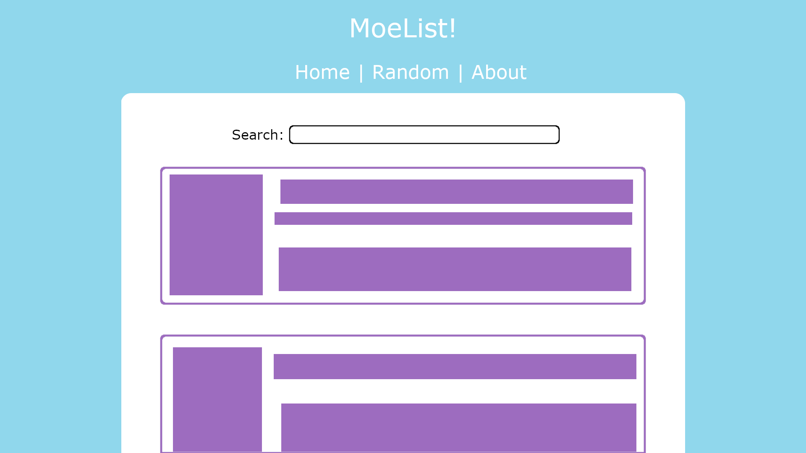
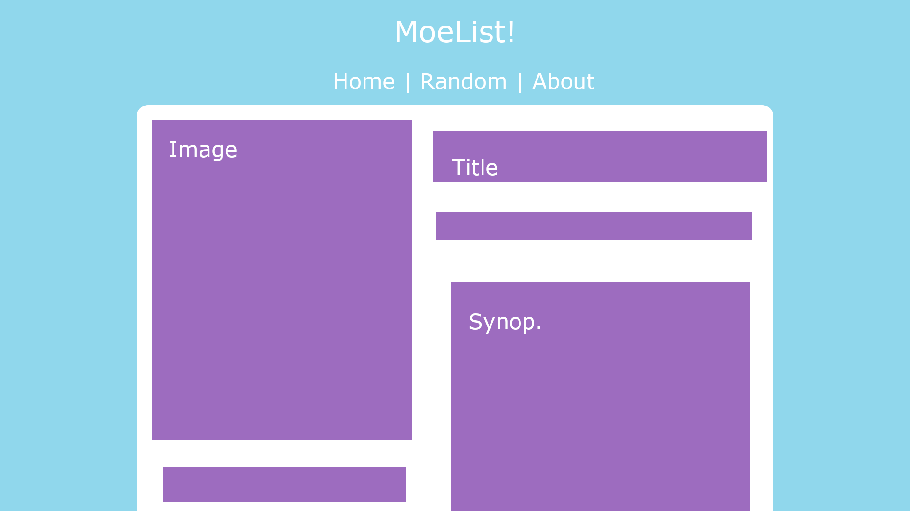
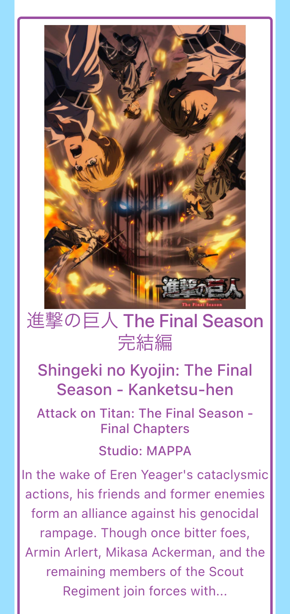
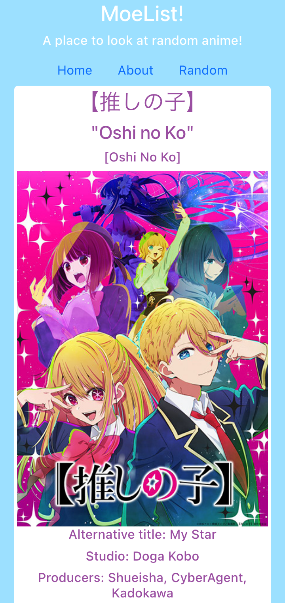
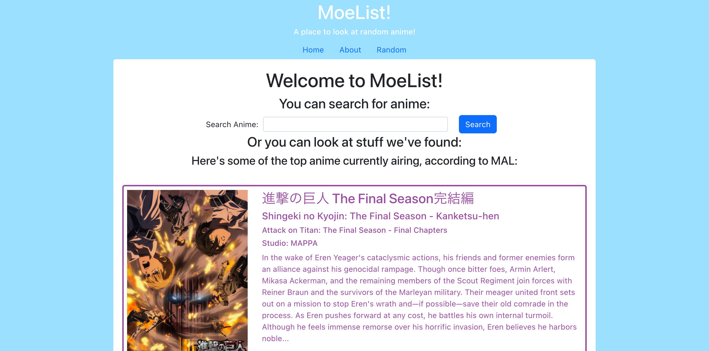
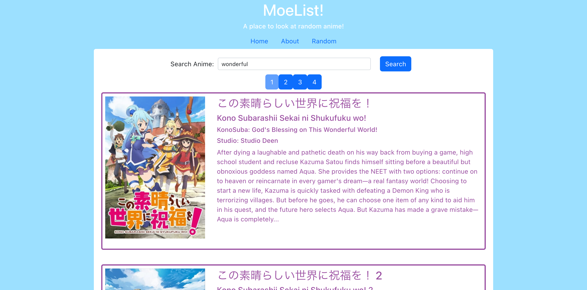
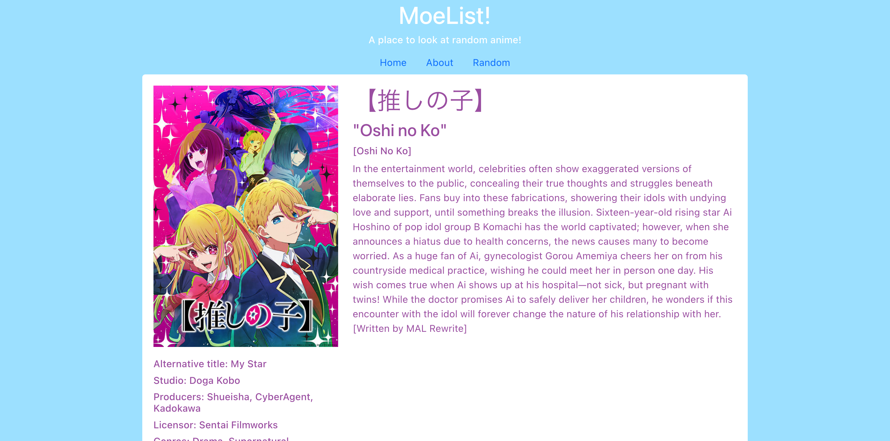

# MoeList!
A React app showing off some anime.

### Why?
One may be new to anime or is bored and in the mood to browse the medium. This site is a simple way just to do just that.

### How?
Using Jikan-TS, a TypeScript wrapper for Jikan, an unofficial API of MyAnimeList, for retrieving show data and information, and React as a frontend, the site aims to be quick and easy to use.

### Where is it?
You can find it [here](https://anime-moelist.netlify.app/)!

## User Stories
### MVP
As a user, I want to be able to...
- [x] Search up a show by title and see results in order to be able to find information easily
- [x] See detailed information about shows in order to be able to know what the show is about
### Stretch/Extra
As a user, I want to be able to...
- [ ] Login or signup in order to be able to access features of this site without my work being overwritten by someone else
- [ ] Save shows to a list in order to track what I want to watch and which I have already watched
- [ ] Add comments to a show in order to signal to others whether I recommend this show or not
- [ ] Add logs to a show in order to detail my experience watching something publicly if I want

## Wireframes

## Screenshots
### Site for mobile

### Site for desktop

## Technologies used
- TypeScript - language
- React - front end
- React Router - easy dynamic routing with React without refreshing
- Bootstrap-React - CSS framework based on Bootstrap made to work specifically with React
- Node.js - Deployment + package dependency handling
- Jikan - API for fetching data - wrapped in Jikan-TS
- Jikan-TS - Jikan wrapper built for TypeScript, with built in types to take advantage of TypeScript strong typing

